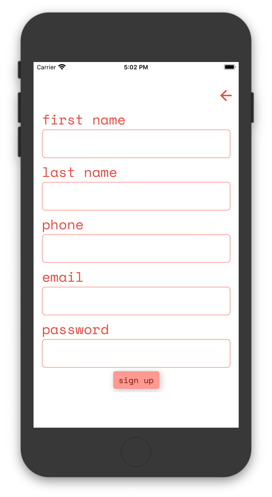
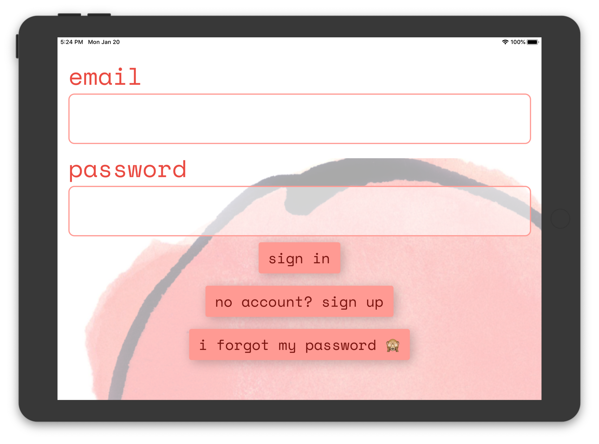

= Creating an Android and iOS App with React Native
izzyreal
2020-01-20
:title: Creating an Android and iOS App with React Native
:tags: [android,ios,react-native]

In this post I'll share my observations and some pros and cons I experienced while creating an app with React Native. I hope it's useful to anyone considering to use React Native, other cross-platform frameworks or fully native codebases.

In my spare time I've been working on an app for the volunteer work that I do at https://buurtbuik.nl/[BuurtBuik]. We have over 6 locations, each hosting a weekly free meal made from food waste.

I'm part of the pool of about 10 coordinators at our location in Amsterdam-West. Every Saturday we need 2 coordinators and 4 to 6 additional volunteers.

One of our coordinators, Jennifer, is in charge of keeping an eye out on the planning, which is collectively maintained on a shared Excel sheet. When there are gaps in the planning, Jennifer rings the alarm bells on our coordinator WhatsApp group to remind us to schedule ourselves to work on a particular Saturday.

_An actual meal served at BuurtBuik_

My incentive for creating an app is that it's cumbersome to search for the shared Excel sheet's URL that was emailed to me a year ago, open it, enter my email address, click a button that will email a verification code to me, go back to my email, copy the code and paste it into the OneDrive form. Once in the Excel sheet, it's quite clumsy to find the particular month and day you want to work and manually type your name.

Doing all this on a mobile device while on the move is much worse, so although I might see Jennifer reach out via WhatsApp for a day that I'm happy to come over and work, I usually wait until I'm at home on my laptop to express and formalise that intent.

So I decided to create a mobile app that will allow users to sign up for a particular day through a minimum amount of interactions.

I'd already settled on writing the backend in Kotlin, but what frontend technology to use? I want to support Android and iOS, and web if feasible. In my decision I had to be realistic about the fact that I'll be the only developer working on this for months to come, and that my previous frontend and UI experience has been in Java with Swing, various C++ frameworks and a couple of months of Vue.js.

I ended up settling for React Native. I like how it's not a browser running some JavaScript, disguised as a mobile app, like some other cross-platform solutions. The community is vibrant, and the instructions, including those for https://expo.io/[Expo], a collections of tools and services for React Native, are short, clear and just work.

On the downside, the differences between Expo and React Native are not clear and coherent to me. It looks like https://stackoverflow.com/questions/39170622/what-is-the-difference-between-expo-and-react-native][this post] exhausts the differences, but I feel some aspects of Expo could easily be part of the standard React Native CLI, and what's left of Expo should be rebranded under the React Native moniker.

Expo makes it a breeze to initialise a new app from a template and run it on your phone or an iOS or Android emulator, though at this stage this happens through a wrapper app called https://expo.io/tools#client[Expo Client]. I later found out staging your app in Expo Client is not 100% the same as running the final compiled native binary, but the difference was minimal: the status bar wouldn't use the color scheme I assigned it on iOS, whereas this was as I intended when running the final binary.

Expo does a great job at getting you started and doing all the plumbing. You'll be hot-reloading the first tweaks to your template app in a jiffy. Hot-reloading remains consistently fast during project lifetime, and most code changes can be hot-reloaded swiftly. This is one of the reasons why I highly rank the developer experience of Expo.

At https://expo.io/learn[https://expo.io/learn] you can see an overview of the required steps to get started:

1. Download and install NodeJS
2. `$ npm i expo-cli -g`
3. `$ expo init my-new-project && cd my-new-project && expo start`
4. Press `a` to run in Android emu, `i` in iOS emu, `w` in browser, or scan QR code to run in Expo Client on your mobile device.

And that really reflects the brevity of my initial steps with Expo and React Native.

image:../media/2020-01-20-creating-an-android-and-ios-app-with-react-native/tabs-template-project.png[]
_The template project I used_

The first bump on the road was about https://facebook.github.io/react-native/docs/navigation[navigation]. The https://github.com/expo/expo/tree/master/templates/expo-template-tabs[template project I used] defines each screen as a function returning some https://reactjs.org/docs/introducing-jsx.html[JSX] (React's syntax extension to JS). This works fine, as long as you limit navigation to tapping one of the icons on your navigation bar.

But my app has a `SignUpScreen` and it's not part of my navigation bar. Navigating to and from this screen happens by calling the `Navigator` instance and React Native gives you access to this instance if your screen or component is defined as a `Component`, like [the navigation docs]https://facebook.github.io/react-native/docs/navigation[the navigation docs] show in the example.

It was unintuitive to me that such a cool, friendly project template starts off on the wrong foot regarding a crucial aspect of mobile app development. But I went through several months of unbridled development after defining my screens properly. I felt very productive and in the zone, refining and redefining features and cosmetics as I progressed.

_The Sign Up screen is not part of the navigation bar. Instead it has a go-back arrow._

Then the next bump came and I wish someone had told me about it before writing the majority of the screens and components. Having a responsive design means that your frontend is capable of dealing with the various screen resolutions of your target platforms. It turns out React Native has no built-in solution or a documented approach for this.

This took me by surprise. Having worked with various UI frameworks for both desktop and web applications, I have nothing but respect for the fine art of deciding and programming the size and layout of design elements. It’s not something a framework can do for you. But React Native implicitly targets a huge variety of pixel counts and aspect ratios.

I'm not a fan of using percentages in a `StyleSheet`, as they relate to the parent component. Often you want a component or design element's size to be directly proportional to the screen width, height and/or orientation.

So I'm telling you now, from the outset use https://github.com/vitalets/react-native-extended-stylesheet[https://github.com/vitalets/react-native-extended-stylesheet] instead of React Native's `StyleSheet`. It allows you to do just that, whether you want to use a custom-defined root https://en.wikipedia.org/wiki/Em_(typography)[em] or percentage for the unit.

_The Sign In screen displayed on an iPhone._

_The Sign In screen displayed on an iPad. Units relative to dimensions support responsive design._

A virtualized list is useful to display a list with many items, because it only renders the items that are visible at a given scroll position. This saves on resource consumption when compared to an ordinary list that keeps all design elements in the UI framework's tree of nodes. Those who do web design are familiar with the https://en.wikipedia.org/wiki/Document_Object_Model[DOM], but a similar tree lives in almost every UI framework. And we want this tree to have as few nodes as possible.

With that out of the way, I hit another impediment a couple of weeks ago when I wanted a virtualized list that allows paginated fetching of its backing data. So far so good -- you can do this with React Native's https://facebook.github.io/react-native/docs/flatlist[`FlatList`]. Now let's add some requirements:

- 100 data elements in total
- data is fetched in pages of 10 elements
- the screen fits 5 to 10 list items of varying size
- initial scroll offset at item 50
- no unnecessary page fetching

The combination of having an initial scroll offset somewhere in the middle without fetching redundant pages turned out to be very tricky. I couldn't make it work, even when using FlatList's parent `https://facebook.github.io/react-native/docs/virtualizedlist[VirtualizedList]` directly. I was convinced I was missing something, but after hours of tinkering I gave up.

It was difficult to figure out what the exact problem was and whether my use case is even supported. The docs are usually a direct path to a solution and VirtualizedList does have an `https://facebook.github.io/react-native/docs/virtualizedlist#initialscrollindex[initialScrollIndex]`. But either the way I'm expected to implement my use case with this component was far from intuitive, or the docs were too ambiguous or uninformative.

Though it felt like I'd searched the web for my use case exhaustively, I gave it one more shot and I discovered this hero: https://medium.com/@naqvitalha/recyclerlistview-high-performance-listview-for-react-native-and-web-e368d6f0d7ef[https://medium.com/@naqvitalha/recyclerlistview-high-performance-listview-for-react-native-and-web-e368d6f0d7ef].

`RecyclerListView` was created to solve a performance problem. Nevertheless it happened to solve _all_ my list's problems. Implementation was a straightforward, follow-the-docs happy path. Mistakes in my implementation were easy to track down and resolve. `RecyclerListView` feels very resilient under the hood and behaves as expected in every way.

At some point you're happy about your app and want to run it on a phone like it would in production. When I was at that stage, it was because I wanted my co-workers at BuurtBuik to test it. So I actually wanted three things:

- Production binaries
- Deployment
- Limited distribution

That's quite a bit more involving than running any binary on your own device as a developer.

Expo does an excellent job at documenting most of the required steps to complete Apple and Google submission processes https://docs.expo.io/versions/latest/distribution/app-stores/[here] and https://docs.expo.io/versions/latest/distribution/uploading-apps/[here].

The Expo CLI helps you https://docs.expo.io/versions/latest/distribution/building-standalone-apps/[build binaries], doing checks along the way regarding assets and various other bits and pieces. Uploading to Google Play is easy as pie, but uploading to Apple Store requires MacOS or an application called http://www.appuploader.net/[App Uploader]. App Uploader doesn't have a pleasant interface, nor is it free to use over 7 days, but as I was traveling with my trusty ThinkPad X1 it's what I used.

After building and uploading, there's a bit of raindance and circus to satisfy Apple and Google. You have to provide export compliance information, some screenshots and other artwork, answer content rating questionnaires, etc.

Most of this stuff is outside Expo's control, but whatever Expo helped me with during this stage, has also allowed me to focus on what needed to be done on App Store Connect and the Google Play Console.

As a free bonus, after  the initial deployment most updates can happen with a simple `expo publish`. These are called https://docs.expo.io/versions/latest/guides/configuring-ota-updates/["Over the Air" (OTA) updates] and make life much easier.

Overall I'm very optimistic about React Native and Expo. They are wonderful tools to initiate and cobble together a mobile app, allowing you to focus on the creative process of designing and writing components and screens. You'll have enough time to pay attention to the flow of your application.

That said, ultimately I like to have fine-grained control over many aspects of my applications. There were many times where I was tempted to rewrite and split up the project into two native codebases and remove Expo, React Native and JavaScript from the equation.

React Native and JavaScript can be sources of noise compared to a codebase in Kotlin or Swift and consulting Android and iOS SDKs. Instead of consulting the source of truth, you'll be consulting an intermediary, biased take on that source.

There's also something inherently vulnerable about React Native's core concept of having one codebase that runs on two diverging platforms, which is that it makes it very tempting to think of your app as something that should look and feel _exactly_ the same, up to the last font, dropdown and swipe gesture, on both platforms.

Though not a flaw of React Native directly, this sentiment is expressed in the fact that there are tons of React Native packages available from NPM that look and feel the same on Android and iOS, even though both platforms have their own _native_ look and feel -- the Android way of doing things and the iOS way of doing things.

There are quite a few things I would 've done differently if I'd written two individual native applications, things that matter a lot when it comes to user experience and satisfaction. I'm thinking primarily of typography, navigation, and details like what the buttons and switches should look like. Then again, next time I'm writing a React Native app, I can take this into account and make decisions based on keeping the app as native as possible.

If you have the people, skills and time, you'll probably want to write two apps, one for each platform, and avoid React Native. If you're tight on any of those resources, React Native is an excellent choice.
