= Polynote, a better notebook for Scala
VincentBrule
2020-09-22
:title: Polynote, a better notebook for Scala
:tags: [scala,big-data]

_This blog was originally published on https://vincentbrule.com/_

Polynote is a _polyglot_ notebook with first-class _Scala_ support. Nowadays, multiple solutions exist to use Scala inside a Notebook. I will explain why I switched from Jupyter to Polynote for all my notebooks.

This article follows a talk given at https://lunatech.nl/[Lunatech]. You can practice with https://github.com/VincentBrule/polynote-talk[these examples]. The slides are also available in the https://github.com/VincentBrule/polynote-talk[resources].

This blog post has two parts. We will start by explaining what is a Notebook and how you can use it in your everyday developer life. Then, we will discover https://polynote.org/[Polynote], a promising Open source notebook solution with first-class Scala support.

== Notebook and its use cases

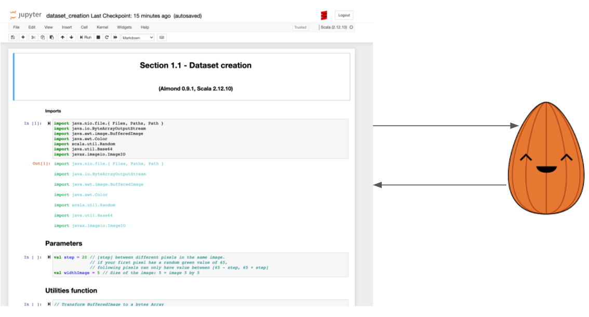

_Figure 1: Summary of how a notebook works (Jupyter + Almond)_

A *notebook* is composed of two parts:

. A *server* running with a kernel corresponding to your language. For example, https://almond.sh/[Almond] is a Scala kernel for https://jupyter.org/[Jupyter]
. A web interface to write your code or text (in Markdown in general)

You can write any language in your web interface as long as it is supported by the kernel running on the server side. Here is a https://github.com/jupyter/jupyter/wiki/Jupyter-kernels[list of all the different kernels for Jupyter notebook]. I am pretty sure you can find your favorite language in this list and start using it in a notebook! Once your code is ready, you can evaluate the cell. The code will be sent to the server and evaluated. After that, the server will return the response to the web interface. Finally, the web interface will wrap the result in some HTML to display the result nicely. That’s the general concept. Each solution adds its own features to provide the best end-user experience.

== My Use Cases
I have started to use notebooks (with https://jupyter.org/[Jupyter]), during my university classes, for practical exercises. It was a convenient way for our teachers to prepare the lessons. Indeed, a teacher can put the code, the questions, and some explanations in the same file. Then, as a student, all you have to do is to install the notebook solution and start working on the teacher’s file. In my school, we used https://jupyter.org/install[Jupyter]. You can install it with a single `pip` command and you are ready to start. I used the same concept to organize workshops recently as you can see with the workshop https://github.com/VincentBrule/workshop_deep_learning[Introduction to Tensorflow in Scala]. I made a `Dockerfile` with everything needed to start the workshop.

It was a great experience and I kept in mind that it can be useful during my everyday life developer. During my graduation internship, I worked on a research project with my supervisor. The difficulty was to work and synchronize together because we were not working in the same city. To solve this problem, we used notebooks extensively to interact with each other on the code. In this case, a notebook brings various advantages. For example, you can:

* run the cells and save the results. For example, with Machine Learning, a cell can take a lot of time to run, so it was an efficient way to share our findings without having to run everything over again
* explain each cell using Markdown, images and Latex
* simply share one file and it contains everything you need to run it
* experiment a solution with multiple languages by simply adding kernels on the server side

Notebooks are popular for these reasons and many more. There are https://en.wikipedia.org/wiki/Notebook_interface[many ways] to start using a notebook in your machine. In the next part, I will show you why I switched completely to Polynote and why you should try it!

== Polynote

_Figure 2: Polynote’s logo_

In this part, I will explain the two main advantages of https://polynote.org/[Polynote] for me. Then, I will show you other useful features of this solution.

=== Polyglot
The main advantage of this solution is to be polyglot. For the moment, https://polynote.org/[Polynote]supports 5 languages:

* Markdown
* Scala
* Python
( Vega
* SQL, I won’t talk about this one because I never use it with Polynote

You can use these *five languages* in the *same notebook*.

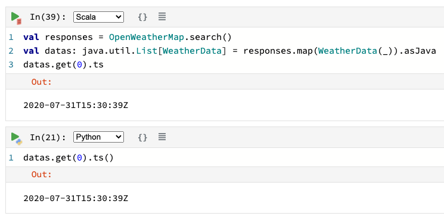

_Figure 3: Interaction between Python and Scala inside a Polynote notebook_

As you can see in _figure 3_, we can easily share Scala data into Python and vice versa. You can find the entire notebook in https://github.com/VincentBrule/polynote-talk/blob/master/notebooks/2_scala_python.ipynb[GitHub]. In this example, we receive a list of weather’s data from the https://openweathermap.org/api[OpenWeather API]. The Scala variable `datas` can be used transparently in Python. To make these interactions possible, you have some restrictions (for example it is easier to use *case class*). Once again, I advise you to take a look at the https://github.com/VincentBrule/polynote-talk/blob/master/notebooks/2_scala_python.ipynb[notebooks] at the same time since they contain more explanations. In addition, you have great interactions between https://spark.apache.org/docs/latest/sql-programming-guide.html[Spark DataFrame] and https://pandas.pydata.org/pandas-docs/stable/reference/api/pandas.DataFrame.html[Python Pandas DataFrame].

=== Visualization

Polynote wraps the results in HTML and adds some additional visualization features for specific types. *Spark DataFrame* and *Pandas DataFrame* have a many options for that.

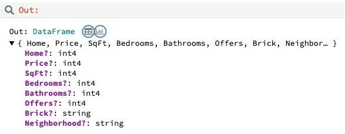

_Figure 4: HMTL Output of a Spark DataFrame_

For example, in the output of a Spark DataFrame or Pandas Dataframe, you have a summary of your DataFrame and two buttons with additional options (the icons with a blue circle in _figure 4_). These buttons will open the popup that you can see in _figure 5_.

image::../media/2020-09-22-polynote-a-better-notebook-to-scala/dataframe-polynote-screen1.png[Extra tools for visualization inside Polynote
{in-between-width}]

_Figure 5: Tools to investigate on your DataFrames_

In my opinion, the most interesting options are *View data* and *Plot data*. In the first one, you can display all your data in a stylesheet style. In the second one, you can easily plot your data by simply selecting your axes and the type of plot as you can see in _figure 6_. It will generate the corresponding block of https://vega.github.io/vega/[Vega] code for you.

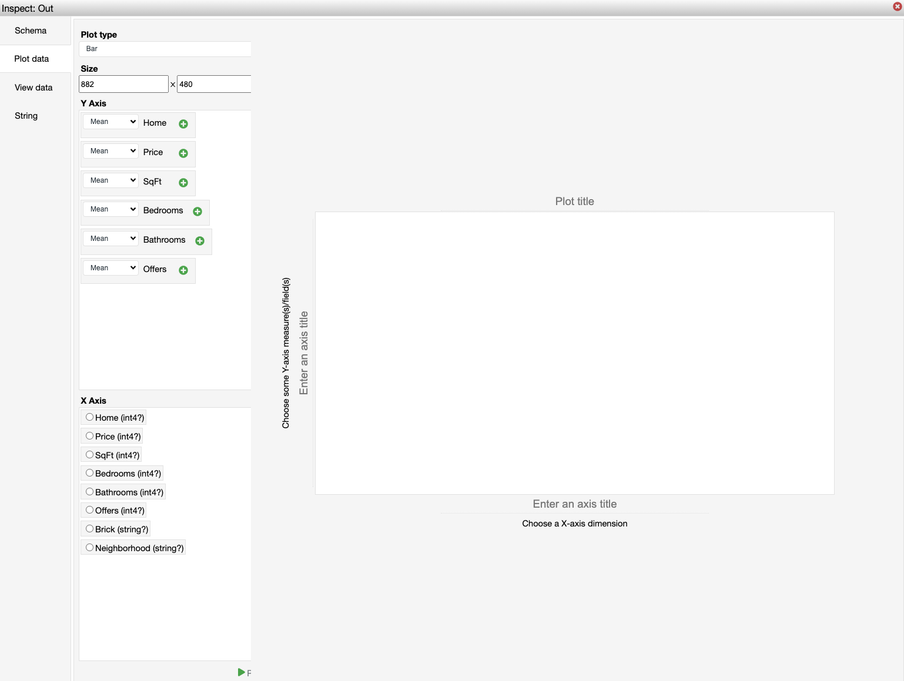

_Figure 6: Plot data option_

Vega is a declarative language that allows you to create a lot of different designs as you can see in their https://vega.github.io/vega/examples/[examples]. If you do not want to use Vega, you can add any plotting libraries such as https://matplotlib.org/[Matplotlib] in Python. But I advise you to try https://vega.github.io/vega/examples[Vega and their examples] because you can make powerful and fancy plots to identify edge cases in your data (_figure 7_). Moreover, Vega works out of the box with Polynote.

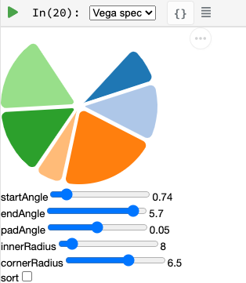

_Figure 7: Vega plot example_

Last thing I want to talk about in this section is the WYSIWYG editor (_figure 8_).

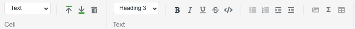

_Figure 8: Polynote’s WYSIWYG editor_

It looks like a small feature but it is useful when you need to style your Markdown snippet and you do not know much about https://github.com/adam-p/markdown-here/wiki/Markdown-Cheatsheet[Markdown syntax].

In this menu, you can also open the https://www.latex-project.org/about/[Latex
] editor (_figure 9_) to write your formulas in an interactive way.

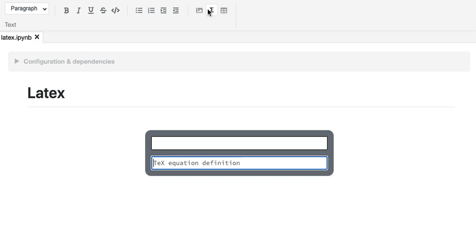

_Figure 9: Polynote’s Latex editor_

All these features allow you to make your notebooks understandable and maintainable over time.

Polyglot and a lot of visualization features made me prefer Polynote compared to other existing solutions. In addition, Polynote brings other improvements that I want to share with you in the following part.

=== Extra Features

==== Order is important

With Jupyter, all cells work with the same global state. If you work with a big notebook, you can quickly mess up with the order of your logic (_figure 10_). If you want your Jupyter notebooks to be organized and maintainable, you have to manage everything yourself and be very rigorous if you work with other people on the same notebook.

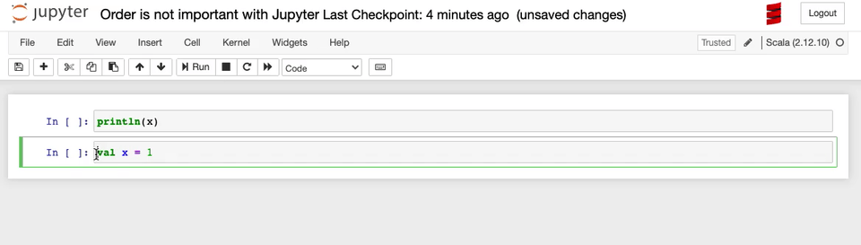

_Figure 10: Order is not important with Jupyter_

Polynote does not use a global state. Each cell has its state defined by all the cells above. As indicated in the https://polynote.org/docs/02-basic-usage.html[documentation]:

[quote]
This is a powerful way to enforce reproducibility in a notebook; it is far more likely that you’ll be able to re-run the notebook from top to bottom if later cells can’t affect earlier cells.

The symbol table will summarize all variables defined in the current state. As you can see in _figure 11_, at the beginning of your notebook, the symbol table is either empty or contains the Spark Session if you have enabled support for Spark in this notebook.

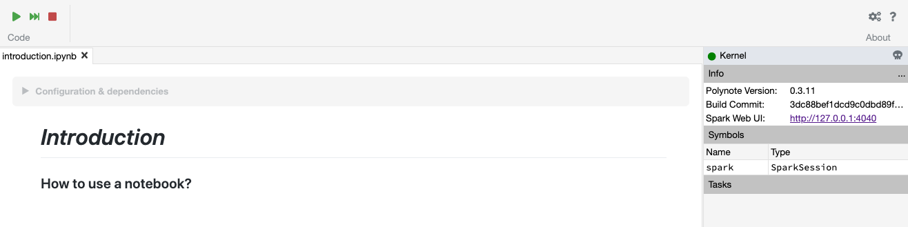

_Figure 11: The symbol table at the beginning of this https://github.com/VincentBrule/polynote-talk/blob/master/notebooks/1_introduction.ipynb[notebook]_

If you run all the cells of https://github.com/VincentBrule/polynote-talk/blob/master/notebooks/1_introduction.ipynb[this notebook], you will have the same symbol table than in the _figure 12_.

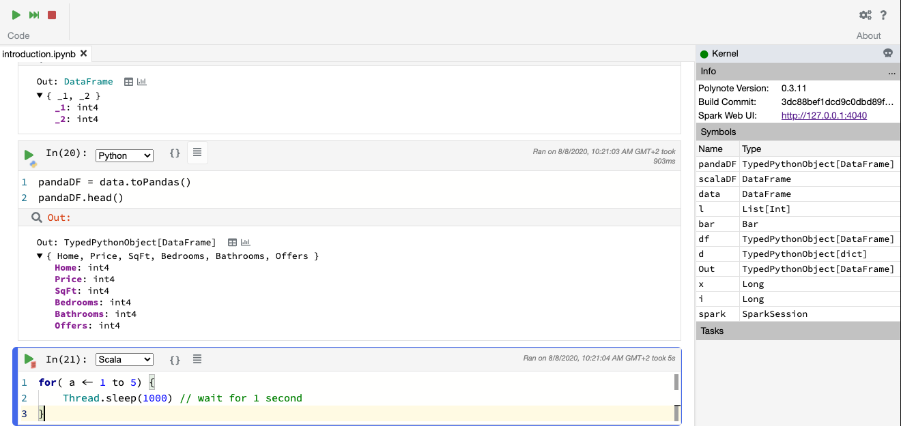

_Figure 12: The symbol table at the end of https://github.com/VincentBrule/polynote-talk/blob/master/notebooks/1_introduction.ipynb[this notebook]_

You can see the name of the variable and its type. In addition, you can click on a variable to visualize your data with Polynote’s tools. Python types are wrapped with `TypedPythonObject`.

If we try the same experiment as we did with Jupyter (_figure 10_), we get *not found error* as expected (_figure 13_).

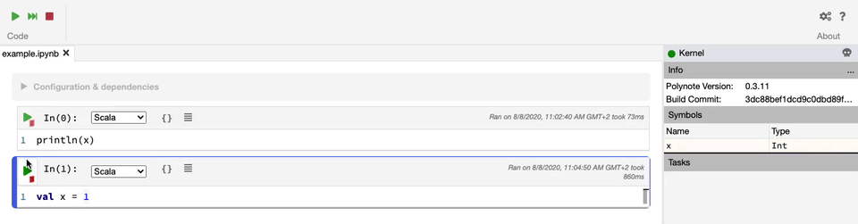

_ Figure 13: Order is important with Polynote_

==== Highlighting running code

Polynote will highlight the current running block until it is completed (_figure 14_). It is a small feature but it was handy when I used Tensorflow with Polynote to quickly detect parts that were taking a long time.

image::../media/2020-09-22-polynote-a-better-notebook-to-scala/running-code.png[Highlighting running code {in-between-width}]

_Figure 14: Highlighting of running code_

==== Code editing

With the previous solution like Jupyter, I used to have an IDE open for new libraries because you do not have code editing at all. Polynote implements code editing capabilities to facilitate your development, such as autocomplete feature (_figure 15_).

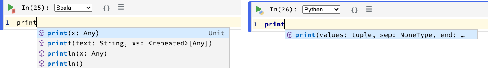

_Figure 15: Autocomplete of Scala and Python code_

===== Organization of the dependencies

The last thing I want to talk about is how the dependencies are organized inside a Polynote’s notebook. Everything is at the top of the notebook in the part Configuration & dependencies (_figure 16_).

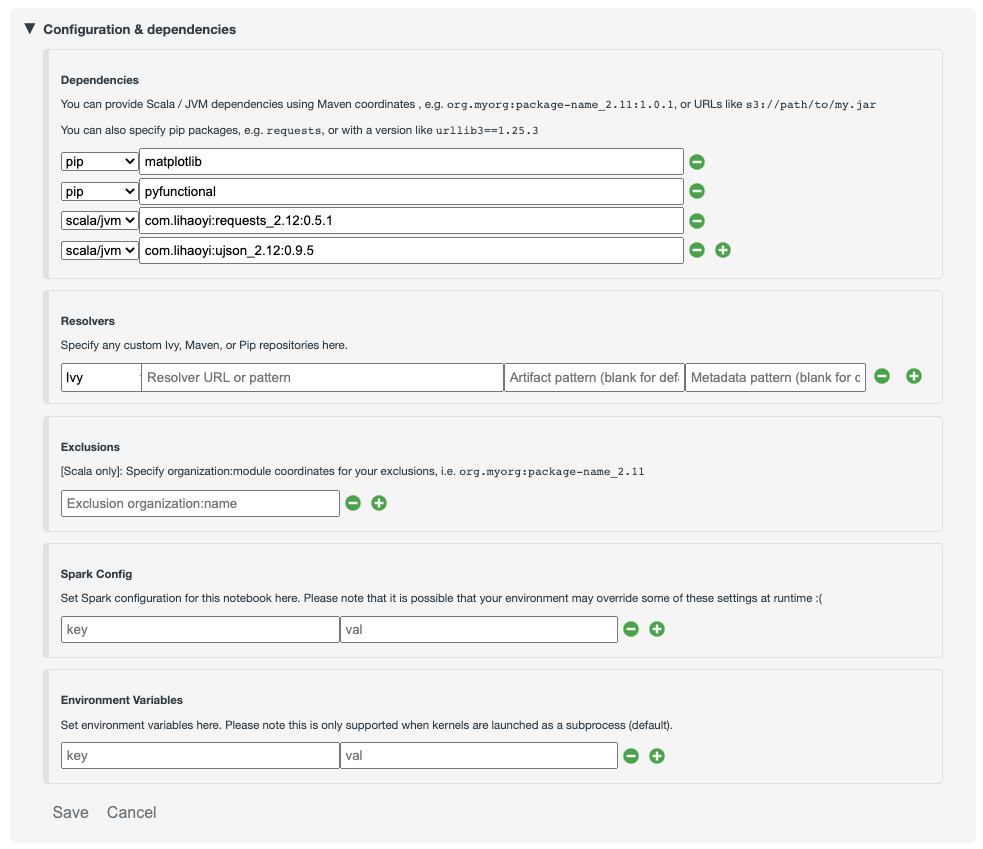
_Figure 16: Configuration & dependencies section_

It is a powerful feature to organize our notebooks. With Jupyter, you have to define your dependencies in a cell as you do with your code, so everything can get mixed up (code + dependencies) and become confusing if you are not rigorous enough. With Almond and Jupyter, you have to know how to use https://github.com/coursier/coursier[Coursier] while Polynote takes care of everything for you.

If you use a dependency in all your notebooks, you can define it in the configuration file of Polynote to have it automatically in each new notebook created.

== Conclusion
Polynote brings a lot of useful features that will make your use of notebooks with Scala easy and pleasant compared to Jupyter. I really appreciate the organization of notebooks with Polynote and this is why I have switched to this solution. Indeed, an organized notebook is better to collaborate with others.

Finally, this project is Open source, https://polynote.org/contribute/[so feel free to contribute if you like the project!]

Thanks for reading and I hope you will want to try Polynote! Feel free to contact me if you have any question about this blog post or https://github.com/VincentBrule/polynote-talk[the example notebooks].

== Resources
1. https://netflixtechblog.com/open-sourcing-polynote-an-ide-inspired-polyglot-notebook-7f929d3f447#:~:text=Code%20editing%20in%20Polynote%20integrates,to%20easily%20insert%20LaTeX%20equations.[Open-sourcing Polynote: an IDE-inspired polyglot notebook]
2. https://github.com/VincentBrule/polynote-talk[Notebooks to discover Polynote]