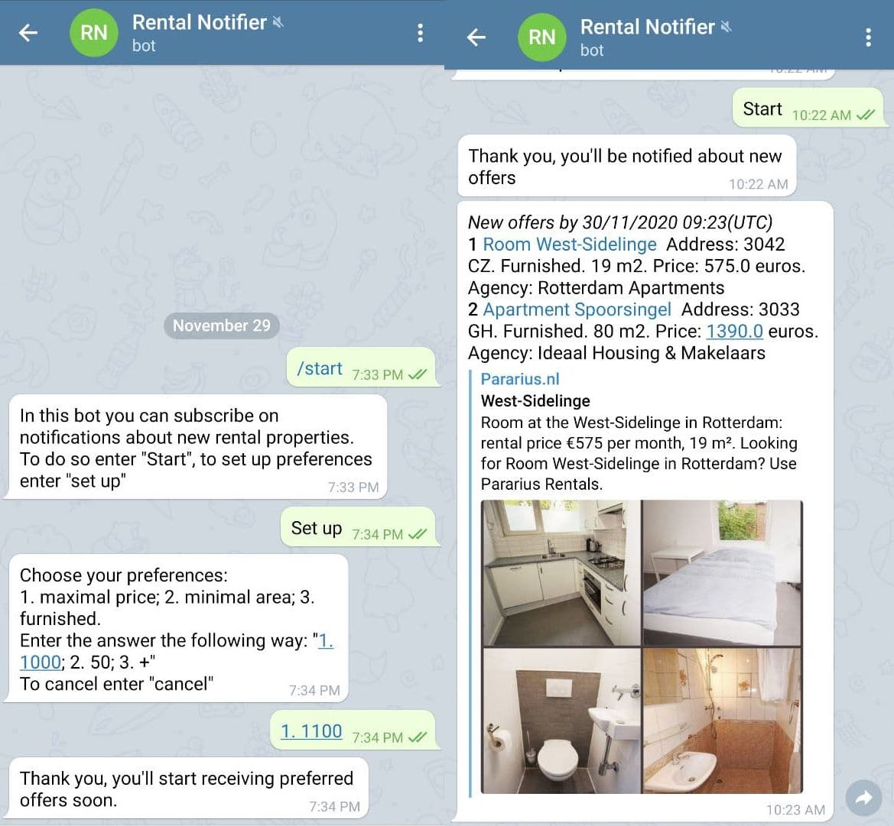
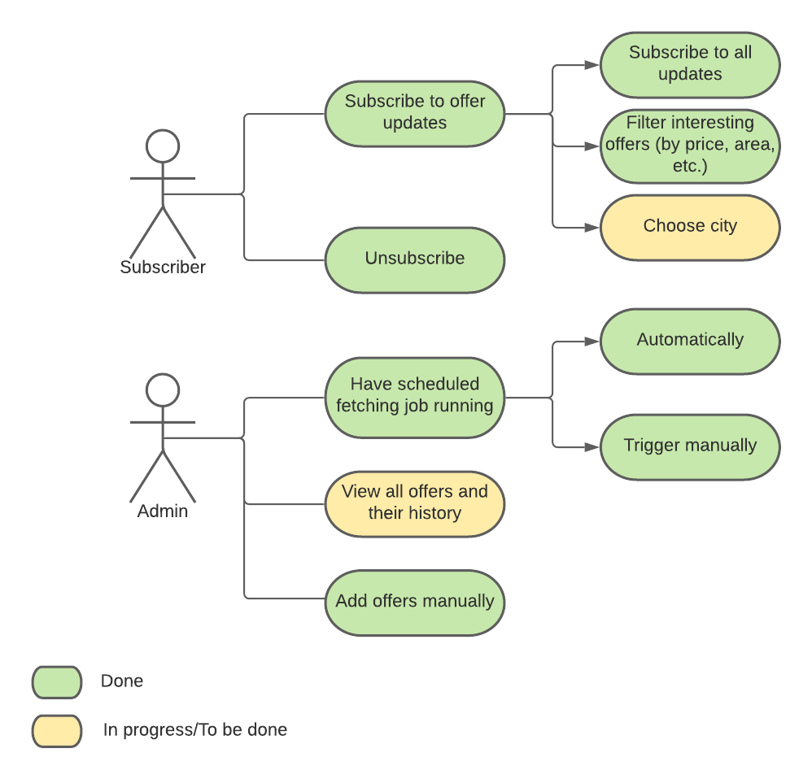
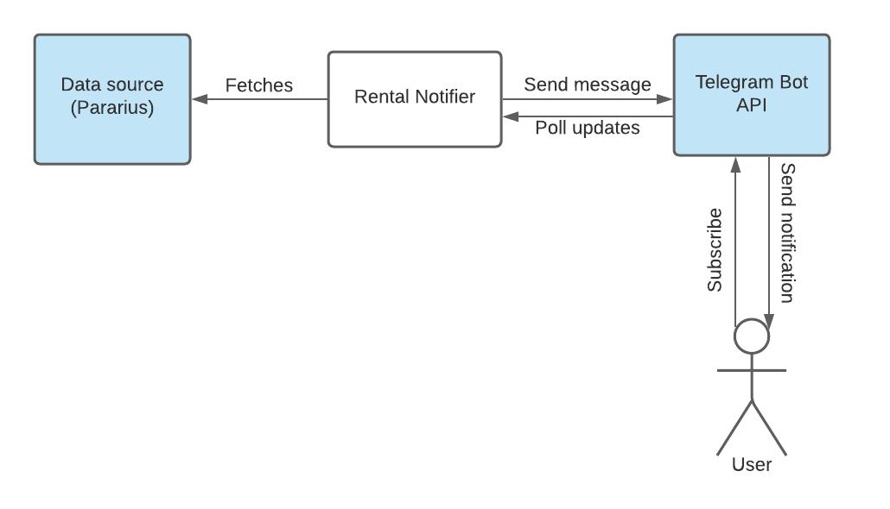
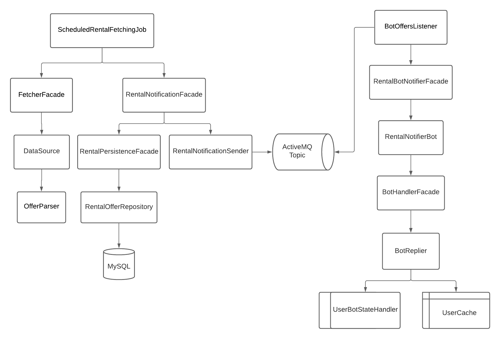

= Creating Telegram bot for rental notifications in Spring Boot
Daria Pindus <daria.pindus@lunatech.nl>
v1.0, 2020-12-14
:title: Creating Telegram bot for rental notifications in Spring Boot
:tags: [java, spring boot, telegram, bot]

During my relocation to Rotterdam everything went smoothly except for one thing - the rental process. There seemed to be not a lot of new offers and keeping track of interesting ones was a bit messy (we even created an Excel table, where we wrote down apartments and all details we were interested in). So using my passion for automation, to improve the onboarding process, and to refresh my knowledge on some technologies, I decided to create a customizable Telegram bot to get notifications on new rental offers in a handy way.

You can find the source on https://github.com/DariaPindus/RealEstateHelper[GitHub], and you can also subscribe to the bot using @rental_notifier_bot

Here is what it looks like:

== My use case

As I mentioned earlier, I struggled to look through new rental offers constantly, some of them were updated and reposted, some deleted, some were irrelevant due to price or location, so it was a little bit hard to keep track of them. This process took a lot of my time so I came up with the idea to solve it in a way that was convenient for me. And what can be more convenient and noticeable than notifications sent directly to you?
So I decided to create a Telegram bot that would send me updates once interesting offers appear. I consider fetching data from only one website, but designing the application in a way that could support more data sources and new cities. During the development, I also thought about the ability of adding not only rental offers but real estate ones or other similar offers you want to be notified about, and as well to integrate chat bots for other messengers. Finally, my intention was to make it possible to automate the process of reply with a user-defined template.

Now let’s take a look at the User Stories Diagram that were completely or partially realized in this version:

== Excursus: Why Telegram ?

Telegram is a pretty common messenger in Eastern European countries and their Bot API is a piece of cake. And I’m kinda a Telegram evangelist as it’s pretty cool and has a lot of great features you should take a look at (like secret chats, cloud storage, bots, groups and channels, voice and video calls, multiple sessions and so on).

== What technologies were used?

I used the following technologies:

* Spring boot 2 - Beloved framework by many Java developers for web development
* MySql database
* Spring data + Hibernate for data access and manipulation
* ActiveMQ for communication between services
* JSoup for HTML parsing
* Junit for testing
* Tomcat server

== How does this project work?
The service periodically fetches and parses the last N pages of a chosen website (what N should be is decided empirically). Then it compares this result with the existing records, deciding whether it is a new offer or updated and keeps history in that case (it could be useful for analytics). Then it passes the records that were changed to the message queue, where they are received by the bot listener. This bot listener triggers Rental Bot abstraction that checks for subscribed users and their preferences. Finally, it filters and sends these recommendations to each user based on their preferences.
Besides having an Admin user, I wanted to have endpoints to manually fetch or insert data through a REST API.

== What about the architecture and the implementation?

Currently the user interacts with the application through the Telegram messenger. Another external dependency is the data source (Pararuis) where the data is extracted from.

And back to the technologies. My intention was to create an extensible server application that could be used for convenient real estate related notifications with possible analytic usage. Here is the component diagram for Rental Notifier:

As I mentioned before, I aimed to design the application to be extensible for future needs.

I used a modular approach, creating 3 base modules (packages) - “bot”, “common”, “rental”. In case of an (unlikely) high growth of the application, such structure will allow splitting the monolith into nice simple microservices. As an additional benefit, the modules are easy to navigate, easy to extend with small risk to affect another module. Furthermore, the communication between them is done through the message broker - ActiveMQ. It facilitates adding independent, easy-to-scale and easy-to-extend modules by adding new topics and new listeners.
As you can see, there are few components. Following best practices I tend to make them small, loosely-coupled, doing one thing at the time, open for extension. As well, I used abstractions and interfaces for easy updates - i.e. supporting new data sources (apart from Pararius) would be a question of few new classes implementing existing interfaces.

No cumbersome patterns or solutions were applied here. I made use of Spring dependency injection to create reusable, small beans. As I mentioned before and as it can be seen in source code, I have my modules be separated by concerns, each concern is grouped into its own package.

We can have a closer look on how everything works together. Let’s begin with rental fetching. There is `ScheduledRentalFetchingJob` that runs scheduled time and aggregates the main job - fetching from data source and sending notifications to the messaging queue. It has `FetcherFacade` to help - it contains a set of supported `DataSource`-s that returns the list of all offers that are parsed by class implementing `OfferParser` (in this case by `ParariusOfferParser`).
These offers are then handed to `RentalNotificationFacade` whose duty is to forward messages to the queue but save them before it.

Persistence process is combined in `RentalPersistenceFacadeImpl`, that allows to manipulate the domain through `RentalOfferRepository` and contains the logic to define which entities are new and should be notified about. As an offer doesn’t have one unique field by which it could be found I decided to create some sort of combined unique field that is created with every new offer and consists of multiple fields. Although it’s sort of data duplication, it can really help for search, that will happen often.

Then these records are returned back to `RentalPersistenceFacadeImpl` where `RentalNotificationSender` sends them to ActiveMQ queue. Also, there is `BotOffersListener` that is waiting for messages. Once it receives them, `BotOffersListener` forwards them to `RentalBotNotifierFacade`, that has access to the main `RentalNotifierBot` and sends created API-supported messages to Telegram bot.

Meanwhile, `RentalNotifierBot` itself can handle incoming messages. For executing all related logic there is `BotHandlerFacadeImpl` to help. This object has `BotReplier` dedicated to manipulating the user state and how to answer messages based on it. To make user state handling easy to extend I decided to create a map of state enum and its logic handler. To access the current state I use `UserCache`. For now, it’s purely in-memory storage - Java Map. But the idea is to use something efficient and fast as this action happen frequently. A better approach I think could be using Redis or something similar.

As the correct answer is created the message is formed and returned back to `RentalNotifierBot` that sends it to a user.

== So what is it all about?

The main feature and goal of the project was storing rental offers from different sources. It would allow them to be analyzed and notified about. The domain model allows to keep the history of offers changes, execution transactionality prevents data from being incorrectly/partially saved, logging allows keeping an eye on failures and mistakes.

As it is a small pet project not everything intended has been done. Among possible enhancements I see the following:

* Parallelizing the process of fetching data
* Better messages aggregation (sending them in batches and more failure-proof)
* Triggering the process of unsubscribing (by deleting conversation with bot) to clean user cache
* More customizations for offers
* API for analytics and better security for it

_P.S._ By the time I finished this project and deployed it to the server we had already found an apartment, so I haven’t really used it. But as I am still subscribed to it I kinda have become an expert in Rotterdam real estate :)