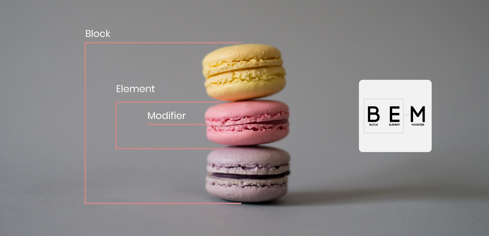
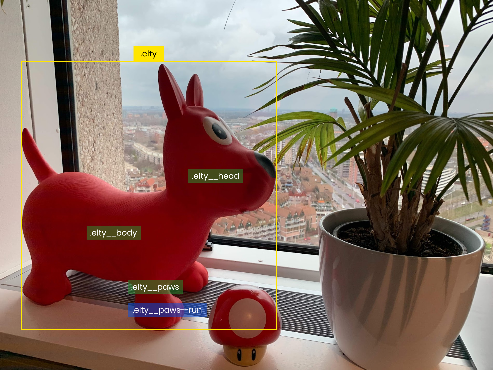
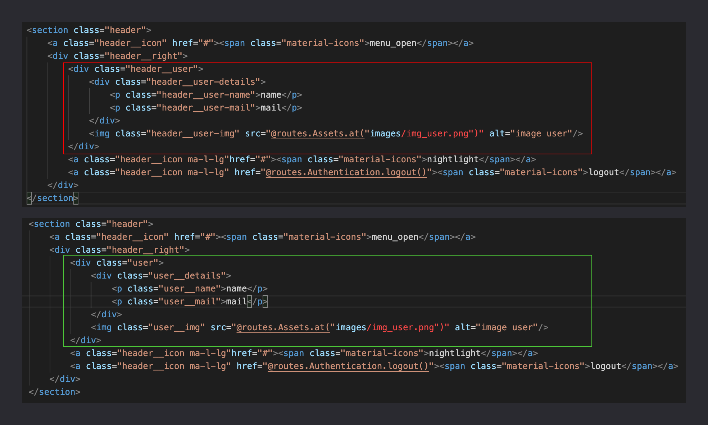

= Rendre son CSS modulaire avec BEM & SASS
geoffroybouet 
v1.0, 2021-10-26
:title: Rendre son CSS modulaire avec BEM et SASS
:lang: fr
:tags: [css, sass, bem]

== Introduction

La rédaction du nommage de nos classes et de nos styles en CSS ne nous contraint pas à une logique particulière, et si bien souvent nous débutons nos styles avec notre propre logique, celle-ci a tendance à s'évaporer et à perdre en cohérence au fil des nombreuses lignes de code, des retours et des déplacements de nos composants.

Si cette pratique n'a pas d'impact sur le visuel de notre application, elle peut en revanche poser un véritable problème sur la lisibilité et la compréhension du code impliquant à long terme des problèmes de maintenabilité et de vitesse. Soyons honnêtes, on passe plus de temps à lire notre code qu'à l'écrire.

== L'approche BEM

.Source : https://unsplash.com/
[caption=""]

La méthodologie que nous allons utiliser ici est la méthodologie BEM qui signifie Bloc, Élément, Modifier.
Pour plus d'informations, n'hésitez pas à consulter la documentation officielle : http://getbem.com/

* Bloc pour composant parent qui contient un ou plusieurs de nos éléments. (Header, nav, footer, etc)
* Éléments pour composants enfants de notre bloc (liens d'une nav, titre, texte, etc.)
* Modifier pour un changement de style sur nos composants (active, changement de couleur au clic, etc.) 

Cette méthodologie va nous permettre de mieux identifier et d'organiser les composants de notre application avec uniquement ces 3 entités. J'insiste sur "uniquement ces 3 entités" car au-delà du fait d'apporter une cohérence au nommage de nos classes, cette méthodologie permet également de nous éclairer sur la nécessité de créer un nouveau composant et de ne pas dépendre de la div parente. En clair, si vous avez besoin d'une 4ème entité pour votre nommage c'est que le découpage de votre composant est peut-être à revoir.

== La convention de nommage

Les 3 entités de cette méthodologie comportent une syntaxe particulière qui est la suivante :

* Bloc : Toutes les classes commenceront par le nom du bloc parent (ex: .menu)
* Éléments : Tous les éléments du bloc parent commenceront par le nom du parent suivi de "\\__" (ex: .menu__link)
* Modificateur : Les modificateurs de nos éléments commenceront par "--" (ex : .menu__link--active)

Comme une image vaut mieux qu'un long discours, prenons donc Elty, notre mascotte, et décortiquons nos classes :

Nous avons donc :

* En jaune, notre bloc
* En vert, nos éléments
* En bleu, notre modificateur

En html nous avons le code suivant :
[source,html]
----

    

    

    

    

----

Cette méthodologie a donc plusieurs avantages, au-delà du fait d'apporter une syntaxe cohérente et une lisibilité à notre code, elle permet également un meilleur découpage de nos composants et donc une meilleure maintenabilité en cas de déplacement de ceux-ci.

Nous voyons que sur le premier screenshot, toutes les classes dépendent de la classe parente et que la nomenclature commence à ne plus respecter la méthodologie :

* header\_\_user
* header\_\_user-details

On sent le besoin d'une entité supplémentaire ou d'une identification plus précise. Cela peut alerter sur le besoin de concevoir un nouveau composant avec sa propre nomenclature pour ne pas dépendre du bloc parent. Sur le second screenshot nous voyons la création de ce nouveau composant :

* user
* user\_\_details

L'utilisation d'une méthodologie permet également d'empêcher d'avoir des conflits sur des classes communes comme un titre du fait de son nommage et de son arborescence en partant du bloc parent. Les classes sont isolées et propres à leur composant respectif.

== SASS dans tout ça ?

L'utilisation d'un préprocesseur CSS comme SASS va nous permettre d'étendre la maintenabilité du code, la lisibilité ainsi que la rapidité. Nous n'allons pas nous intéresser ici à la définition des variables, des mixins & à notre arborescence avec les imports de partiels. Certes ce sont des éléments qui contribuent à la modularité de notre code CSS mais ce qui nous intéresse ici, ça sera uniquement le nesting (imbrication des sélecteurs en scss).

En effet, le travail que nous avons fait en amont avec la méthodologie BEM nous permet une meilleure lisibilité et écriture du code dans nos différents fichiers .scss.

Si nous continuons notre exemple avec notre mascotte Elty, cela donne en CSS :
[source,css]
----
.elty {
    width: 450px;
    height: 280px;
    background: red;
}
.elty__head {
    width: 450px;
    height: 280px;
    border-radius: 50%;
}
.elty__body {
    width: 320px;
}
.elty__paws {
    height: 100px;
    width: 50px
    border-bottom-left-radius: 50%;
    border-bottom-right-radius: 50%;
}
.elty__paws--run {
    transform: rotate(45deg);
}
----

Notre nomenclature de nommage est certes plus claire et plus cohérente grâce à BEM mais nous pouvons voir une lecture redondante dans la façon d'écrire au format CSS.

Simplifions cela grâce au nesting et aux raccourcis offerts par SASS :
[source,css]
----
.elty {
    width: 450px;
    height: 280px;
    background: red;
    &__head {
        width: 450px;
        height: 280px;
        border-radius: 50%;
    }
    &__body {
        width: 320px;
    }
    &__paws {
        height: 100px;
        width: 50px
        border-bottom-left-radius: 50%;
        border-bottom-right-radius: 50%;
        &--run {
            transform: rotate(45deg);
        }
    }
}
----

Ici, nous n'avons plus de duplication de nos sélecteurs, SASS permet une meilleure lisibilité de notre code. Chaque élément BEM que nous avons déclaré au préalable en HTML est visible grâce à l'indentation. Nous pouvons voir notre bloc parent en tête de code puis nos différents éléments imbriqués directement à l'intérieur de notre classe avec "\&\_\_" et enfin notre modificateur à l'intérieur de notre élément ciblé avec "\&--".

== Conclusion

Nous avons donc vu comment rendre notre CSS modulaire grâce à la méthodologie BEM et à son utilisation avec la syntaxe en SCSS grâce au préprocesseur SASS. Sachez qu'il existe beaucoup d'autres méthodologies (OOCSS, MCSS, SMACSS, etc.).
Outre le fait de trouver une logique de nommage à nos classes et donc une bonne méthodologie, la combinaisons de ces 2 éléments nous permet également de voir les limites de nos composants, de réduire le risque de conflits entre les classes mais aussi de mieux découper et modeler notre application.
